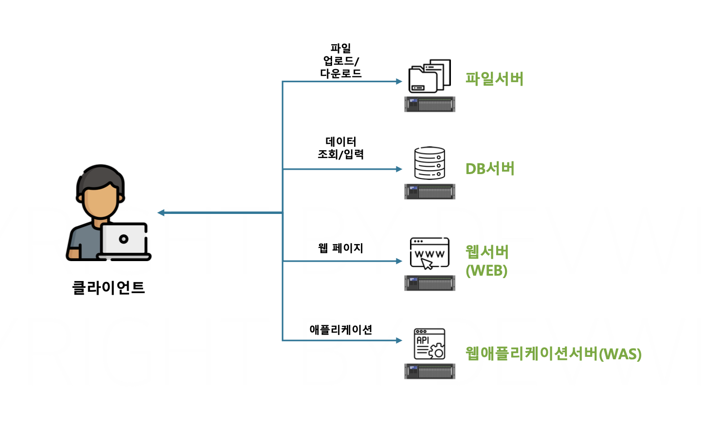

# 섹션 2. 가상화 기술

# 파트 소개

- **도커** : 컨테이너를 관리하기 위해 만들어진 소프트웨어
- **컨테이너** : 큰 서버를 효율적으로 나눠서 사용하기 위한 가상화 기술

→ 서버를 사용하는 이유와 가상화 기술에 대해서 알아보자!

---

# 애플리케이션 서버

## ✅ 서버(Server)

> 클라이언트의 요청에 대한 결과를 제공해주는 역할
> 

하드웨어와, 그 하드웨어에서 실행 중인 소프트웨어까지 모두 포함하는 단어

하드웨어와 소프트웨어 둘 중 하나만 두고도 서버라고 부른다!

- “서버의 전원이 꺼졌습니다” → 하드웨어 서버
- “서버 설치 파일을 다운받았습니다” → 소프트웨어 서버

## ✅ 서버의 종류

> 서버에서 어떤 소프트웨어가 실행 중인지에 따라 분류 가능
> 



- 파일서버
    - 파일 공유 소프트웨어가 설치된 서버
    - 클라이언트에게 파일 공유 기능을 제공
- DB서버
    - 데이터를 관리하는 DBMS가 설치된 서버
    - 클라이언트에게 데이터 저장 기능을 제공
    - ex. MySQL, PostgreSQL, OracleDB 등
- 웹서버(WEB)
    - 클라이언트(웹 브라우저)로부터 HTTP 요청을 받아 정적인 웹 페이지(HTML, CSS, JavaScript 등)를 제공하는 서버
    - 주로 정적 콘텐츠(이미지, 문서 등)를 처리하며
    - ex. Nginx, Apache 등
- 웹 애플리케이션 서버(WAS)
    - Java 와 같은 프로그래밍 언어로 개발된 백엔드 애플리케이션을 실행하는 서버
    - 동적인 요청 처리, 데이터베이스와 연동하여 클라이언트에게 필요한 데이터 제공
    - ex. Tomcat, WildFly, Spring Boot 등

## ✅ 엔터프라이즈 서버 운영


**엔터프라이즈 환경 : 대규모 조직(기업, 공공기관 등)에서 사용하는 IT 시스템 및 소프트웨어가 운영되는 환경*

- 베어메탈
    - 서버 구입 → 해당 서버 위에 OS설치 → 여러개의 소프트웨어 실행
    - 기업에서 운영하기 비효율적!
- 하이퍼바이저
- 컨테이너
    - Dokcer !!

# 가상화기술과 하이퍼바이저 가상화

## ✅ 가상화 기술


### **📌** 무엇인가용?

- 실제로 존재하는 컴퓨터는 아니지만, 마치 컴퓨터가 있는 것처럼 만들어주는 기술!
- 사용자는 한 대의 컴퓨터만으로도 마치 여러 대를 가진 것처럼 사용할 수 있다.

→ **“하나의 컴퓨터에서 여러 개의 독립적인 운영체제(OS)를 실행할 수 있도록 해주는 기술”**

### **📌 가상화 기술을 안쓰면..**

- 하나의 OS에서 모든 프로그램을 실행하면, 한 프로그램에 문제가 생길 경우 다른 프로그램에도 영향을 줌
- 특정 리소스(CPU, 메모리)를 과도하게 사용하는 프로그램이 있으면 다른 프로그램 성능이 저하됨
- 여러 개의 서버를 운영해야 하는 경우, 물리적인 장비를 추가하면 비용이 많이 들고 유지보수가 어려움

### **📌** 가상화 기술 쓰면,

- 한 대의 컴퓨터에 여러 대의 논리적인 OS 환경 만들 수 있고,
- CPU, 메모리 등 리소스를 직접 설정하고 분배할 수 있고,
- 장애 발생 시 다른 시스템에 영향을 주지 않는다!

## ✅ 하이퍼바이저 가상화

> **- 물리 서버의 리소스를 가상화하여 여러 개의 가상 머신(VM)을 실행할 수 있도록 하는 기술
- HW와 VM 사이에서 리소스를 관리하고, 서로 다른 OS가 실행될 수 있도록 해주는 기술**
> 


### **📌 용어**

| **Host OS** | - 실제 물리적인 서버에 설치된 OS
- 하이퍼바이저 설치해서 가상 환경을 만들 수 있음 |
| --- | --- |
| **하이퍼바이저** | - Host OS의 자원을 가상화해서 여러 개의 VM을 실행할 수 있게 함
- 각 VM이 독립적으로 실행될 수 있도록 자원을 분배 |
| **Guest OS** | - 하이퍼바이저 위에서 실행, 독립적인 OS 로 동작
- 자체적인 커널 보유 → 프로세스 실행 가능! |
| **가상 머신(VM)** | - 하이퍼바이저 통해 실행되는 독립적인 가상 환경 |


프로세스는 정상적으로 실행되기 위해서는 CPU, 메모리, 디스크 같은 리소스를 사용해야 한다.

But, 프로세스는 직접 하드웨어를 제어할 수 없고, OS 를 통해서만 사용할 수 있다!

→ OS에는 하드웨어 제어 기능을 제공하는 *“커널”*이 설치되어 있다.


- 하이퍼바이저는 “통역가” 역할! → 호스트 OS와 다른 종류의 게스트 OS도 사용할 수 있다.
- 하이퍼바이저는 특정 제품이 아니라, 기술의 종류!
    - VirtualBox, vmware 등 다양한 하이퍼바이저 소프트웨어들이 있음~

# 컨테이너 가상화

## ✅ 컨테이너란?

- 애플리케이션과 그 실행 환경을 패키징하여 독립적으로 실행할 수 있도록 만든 가상화 기술
- **별도의 Guest OS를 실행하지 않고 Host OS의 커널을 공유하여 실행**
- 하이퍼바이저 가상화 방식보다 “빠르고”, “가볍다”
- Docker, Kubernetes

## ✅ 비교


커널 자체의 기능만 활용해서 격리된 공간(컨테이너) 만들 수 있다.

모든 컨테이너가 Host OS의 하나의 커널을 공유해서 사용한다!

→ 중간 단계가 따로 없으므로, 오버헤드가 적음. 부팅이 빠르다.

→ But, 호스트 OS와 다른 종류의 OS는 실행할 수 없다. 

🧑🏻 커널이 자체적으로 제공하는 가상화 기술은 사용자가 직접 컨트롤하기 어려움.

→ 도커가 이 커널의 컨테이너 가상화 기술을 편리하게 사용할 수 있도록 해줌.

# 도커(Docker)

## ✅ 도커?

- **컨테이너 기반** 가상화 기술 제공하는 플랫폼
- 도커와 같은 컨테이너 가상화 도구를 컨테이너 플랫폼이라고 함.

## ✅ 컨테이너 플랫폼의 구성 요소


- **컨테이너 엔진**
    - 사용자 요청을 받아 컨테이너를 실행하고 관리하는 역할
    - Docker Engine 이 컨테이너 엔진의 역할!
- **컨테이너 런타임**
    - 직접 OS커널과 통신하면서 실제로 격리된 공간을 만들고 컨테이너를 실행
    - 도커는 runc 라는 컨테이너 런타임을 사용. (다른 런타임으로 변경 가능)


- 도커는 클라이언트-서버 모델 기반으로 동작!
    
    → 사용자가 입력한 명령을 서버(도커 데몬)이 받아서 실행
         **데몬 : 서버에서 지속적으로 실행이 되는 소프트웨어*
    
- 컨테이너를 관리하기 위해 API 명세서를 제공한다.
    - 근데 이런 API 들을 사용자가 직접 사용하기에는 복잡하니까 Docker CLI 를 제공. (ex)`docker ps`
    **CLI : 클라이언트가 명령어를 입력하면 이 명령어를 서버의 API 양식에 맞게 만들어서 대신 전달한다.*

# 컨테이너 실행

> 목표 : Nginx 웹서버 컨테이너를 실행시키고, 웹페이지에 접속해보자.
> 

1. 도커 버전 확인

`docker version`

1. 도커 정보 확인

`docker info`

1. 도커 명령어 가이드 확인

`docker - -help`

명령어가 기억 안날때마다 가이드 얻을 수 있음

`docker container - -help`

컨테이너 다음에 어떤 명령 입력할 수 있는지 확인해 보기 위한 명령어

### ✅ 도커 명령어 기본 구조

```bash
docker (Management Command) Command
```

() 안의 대분류는 보통 생략해서 사용할 수 있는 것은 생략해서 자주 사용함.

docker container run을 docker run으로만 쓰는 것처럼.

### ✅ 컨테이너 실행

```bash
docker run (실행옵션) 이미지명
```

`docker run -p 80:80 --name hellonginx nginx`

- -p 80:80 → 호스트(내 컴퓨터)의 80번 포트를 컨테이너의 80번 포트와 연결
- --name hellonginx → 컨테이너 이름을 hellonginx로 지정
- nginx → 사용할 컨테이너 이미지


### ✅ 컨테이너 삭제

`docker rm hellonginx`


# 정리

1. 내 노트북에 도커 설치 → 호스트 OS 에서 실행중
2. docker run nginx 명령어 입력
3. Docker CLI 가 해당 명령어를 도커 API 형식으로 만들어서 도커 데몬에게 전달
4. 도커 데몬은 요청을 분석해서 컨테이너 런타임을 통해서 컨테이너를 생성
5. 컨테이너 내부에서 Nginx 실행 → 로컬 호스트 접속 시 웹페이지를 제공해준다.
6. 컨테이너를 생성해서 프로세스를 실행시키면 → 이 프로세스는 호스트 OS(디스크나 네트워크, 메모리, CPU 등) 와 완전히 격리된 상태에서 실행 가능
