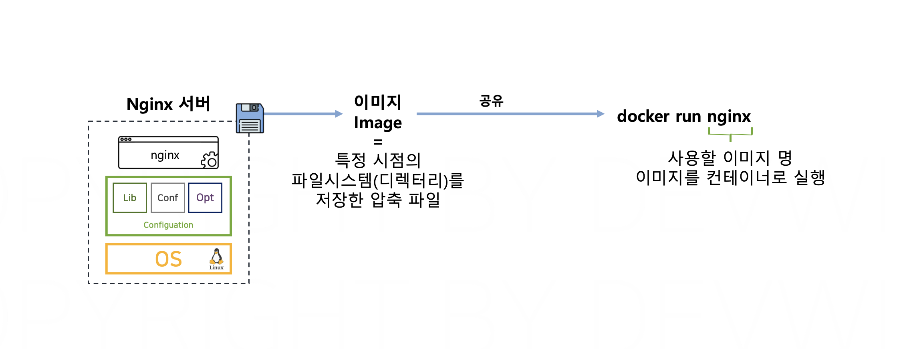
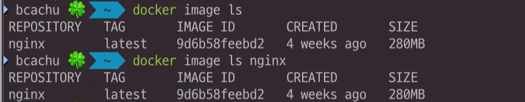

# 섹션 3. 이미지와 컨테이너

# 이미지

## ✅ 도커 이미지



### **📌 Docker로 Nginx 서버 실행하기**

- 앞선 섹션 2에선 서버를 구상하는 과정 없이, 한 번에 Nginx 프로그램을 실행했다.
- `How?` Nginx 이미지를 통해서 컨테이너를 실행했기 때문에 가능했음!

### **📌 Docker 이미지란?**

- 특정 시점의 파일시스템(디렉터리)를 저장한 압축 파일
    - 소프트웨어 실행 위해 필요한 모든 요소들을 미리 준비해서 압축해놓음.
    - 실행할 준비가 된 상태로 저장됨
    - 여러 환경에서 일관된 실행 환경을 제공함
- 가상머신의 스냅샷과  비슷하지만, 도커 이미지는 압축파일의 사이즈가 아주 작음
    - 인터넷을 통해서 쉽게 공유 및 배포가 가능하다.

## ✅ 컨테이너의 실행 원리와 구조


### 📌 컨테이너 실행 과정

- 컨테이너 엔진 : 컨테이너 관리 `docker engine`
- 컨테이너 런타임 : 실제 컨테이너 실행 `runc`
- 컨테이너는 이미지를 통해서 실행시킬 수 있다.
    - 실행시키면 호스트 OS 내에서 완전히 격리된 공간인 컨테이너가 만들어짐
    - 이 독립된 공간 안에서 소프트웨어가 실행

# 이미지와 컨테이너

## ✅ 프로세스 vs. 프로그램


- **프로그램**
    - 리소스 사용 안하고, 스토리지의 디스크 공간만 차지
    - (ex) 크롬 설치 파일
- **프로세스**
    - 파일 형태의 프로그램 실행시키면 프로세스가 된다.
    - 실행 시 OS 가 리소스 할당
    - (ex) 프로그램 1개 → 여러 개의 프로세스로 실행 가능함! 크롬 창 여러개 실행..

## ✅ 이미지 vs. 컨테이너


- **이미지**
    - 실행 가능한 소프트웨어 + 실행에 필요한 환경이 포함된 **파일 시스템**
    - 디스크에 저장된 상태, 리소스 사용 X
    - 하나의 이미지로 여러 컨테이너 생성 가능
- **컨테이너**
    - 이미지를 실행한 상태 (이 순간부터 리소스 사용)
    - 프로세스와 다른 점은, 가상화기 때문에 격리된 공간에서 실행되는 것.
    - 컨테이너 내부에서 실행되는 프로그램은 일반 프로세스 처럼 동작!

### 📌 로컬 디스크에 저장되어 있는 도커 이미지를 조회할 수 있는 명령어

```bash
docker image ls (이미지명)
```



- Repository : 이미지의 이름
- Tag : 이미지의 버전
- 각각의 이미지는 고유한 아이디를 가지고 있다
- 만들어진 날짜와 이미지의 사이즈도 확인 가능

### 📌 하나의 이미지로 여러 개의 컨테이너 실행하기


```bash
docker run -d --name multinginx1 nginx
docker run -d --name multinginx2 nginx
docker run -d --name multinginx3 nginx
```

- 컨테이너의 이름 지정 가능(시스템 내에서 중복 불가능)
- `-d 옵션` : 백그라운드 모드로 실행 (터미널을 점유하지 않음)
    - nginx 처럼 지속적으로 실행되는 데몬 프로세스 같은 경우에는 -d 옵션 주어야 다음 명령어 입력할 수 있으니까 좋음!
    - 그냥 실행 후 종료되어서 실시간으로 로그 출력에서 확인할거면 안주면 됨
- 아이디는 달라도 이 3개가 사용하는 이미지는 같다!

### 📌 실행중인 컨테이너 확인

```bash
docker ps
```

### 📌 실행중인 컨테이너 삭제


```bash
docker rm -f <삭제할 컨테이너명>
```

- 실행중인 컨테이너를 삭제하려면 오류가 발생함!
    - `-f 옵션` : 실행중인 컨테이너 강제 삭제

# 이미지의 메타데이터(Metadata)

### 📌 메타데이터

> “데이터에 대한 데이터”
> 
- 이미지가 실제로 압축된 실행 파일이라면,
- 메타데이터는 이미지에 대한 정보를 저장하는 데이터
    - (ex) 화분마다 이름, 물을 주는 주기를 라벨로 관리하듯이
    - Docker 이미지에는 이름, 사이즈, 환경설정 등이 메타데이터로 저장됨

### 📌 Env

> 환경 변수
> 
- 애플리케이션이 사용하는 환경 설정 값. 소프트웨어가 실행 시 참조할 설정 정보.
    - = 을기준으로 왼쪽이 키고 오른쪽이 키에 해당하는 값이 된다. "KEY=VALUE"

### 📌 Cmd

> 컨테이너가 실행될 때 자동으로 실행되는 명령어
> 
- CMD는 Docker 이미지에 저장된 **기본 실행 명령어**
- nginx 이미지는 기본적으로 다음과 같은 CMD를 가진다
`docker inspect nginx | grep Cmd`
    
    ```bash
    "Cmd": ["nginx", "-g", "daemon off;"]
    ```
    
    즉, 컨테이너가 실행될 때 **`nginx -g daemon off;`** 명령어가 실행된다!
    
    // 백그라운드 실행을 막고, 포그라운드에서 실행 유지
    

## ✅ Cmd 덮어쓰기

### 📌 nginx 이미지의 메타데이터 확인하는 명령어

```bash
docker image inspect nginx
```


- id, 이미지를 다운받을 때 사용하는 태그, 이미지 생성 시간도 확인 가능~
- Config 쪽 보면 Env와 Cmd 필드도 확인 가능
    - cmd 필드는 띄어쓰기가 안되기 때문에, 띄어쓰기 기준으로 배열로 저장됨!

### 📌 설정 변경사항 없이 컨테이너 실행

nginx 이미지를 defaultCmd 이름의 컨테이너로 실행

```bash
docker run -d --name defaultCmd nginx
```


 실행된 컨테이너의 메타데이터 확인

```bash
docker container inspect defaultCmd
```


동일한 env와 cmd 확인 가능!

### 📌 메타데이터 덮어쓰기로 이미지의 파일 출력

> 기본적으로 Docker 이미지는 실행될 때 특정 명령어(CMD)를 실행하도록 설정되어 있음. But, docker run 명령어 뒤에 다른 명령어를 입력하면 CMD를 덮어쓰는 효과가 발생!
> 

⇒ 즉, **Docker 컨테이너 실행 시 기본 명령어 대신 원하는 명령어를 실행할 수 있다!!**

- 도커 컨테이너 실행에 사용할 수 있는 모든 옵션을 출력

```bash
docker run --help
```


1️⃣ 기본 컨테이너 실행 (백그라운드로 실행됨)

```bash
docker run --name customCmd nginx
```

2️⃣ nginx 컨테이너를 실행하면서 기본 실행 명령어 대신 **cat 명령어 실행**

cat 은 일회성 명령이기 때문에 -d 옵션을 넣지 않고, 컨테이너가 출력하는 내용을 직접 확인!

```bash
docker run --name customCmd nginx cat
```

3️⃣ cat 명령으로 컨테이너 내부 파일 내용 출력

usr/share/nginx/html/index.html은 기본적으로 nginx가 제공하는 HTML 파일

```bash
docker run --name customCmd nginx cat user/share/nginx/html/index.html
```


저번 파트에서 nginx 웹사이트에 접속했을 때의 화면이랑 동일한 내용임!

`docker container inspect customCmd` 명령어로 확인해보면, cmd 필드의 값이 바뀌어 있는 것을 확인할 수 있다.


❓`docker ps` 명령어 입력하면 customCmd 는 보이지 않는다!

cat 명령어는 컨테이너가 실해되고 종료되는 일회성 컨테이너기 때문에 cmd 에서 지정한 cat 명령이 종료되는 순간, 컨테이너도 함께 종료되기 때문. 

종료된 상태의 컨테이너는 `docker ps -a` 명령어로 확인해야 함~


이 컨테이너는 이미지의 데이터를 복사해서 만들어지기 때문에, 실제로 컨테이너의 메타데이터를 바꾼다고 해서 이미지의 메타데이터가 바뀌지는 않는다!

`docker image inspect nginx` 해서 확인해보면 cmd 필드가 그대로인 것을 확인할 수 있다.


**⇒ 즉, 우리는 이미지를 복사해오면서 실행하는 시점에서 컨테이너의 메타데이터만 변경 가능!** 

### 📌 정리


---

## ✅ Env 덮어쓰기

> **컨테이너 실행 시 --env 옵션을 사용하면 해당 환경 변수를 덮어쓸 수 있다.**
> 

❓이번 실습에 사용해 볼 “Env Color Application”

- 사용자에게 특정 색상의 웹/페이지를 응답해 주는 애플리케이션
    - 컨테이너를 실행할 때 어떤 설정을 하냐에 따라서 웹페이지 글씨 색상 달라짐
    - 따라서, 컨테이너 실행 시 환경 변수를 변경하면 다른 색상의 웹페이지를 제공할 수 있다!

```bash
docker run -d -p 8081:3000 --name blueColorApp --env COLOR=blue devwikirepo/envnodecolorapp
docker container inspect blueColorApp
```


# 컨테이너의 라이프사이클(Lifecycle)


### 📌 생성 단계

- 이미지를 컨테이너로 만들기

```bash
docker create
```

컨테이너를 실행하기 위한 격리된 공간이 만들어진다.

모든 리소스(네트워크, 스토리지, 환경 변수)가 격리된 공간인 컨테이너로 분리된 상태

내부에서 프로세스를 실제로 실행하지 않기 때문에, 호스트 OS 의 CPU와 메모리 사용 안함.

### 📌 실행 단계

- 컨테이너의 메타데이터의 cmd 값을 사용해서 컨테이너 러닝 상태로 만듦.

```bash
docker start
```

컨테이너 내에서 정상적으로 프로세스 실행한다!

- create 와 start 명령어를 합친 것

```bash
docker run
```

- 프로세스 재시작

```bash
docker restart
```

---

### ✅ 컨테이너 상태 및 로그 확인

```bash
### 일회성 출력
docker logs <컨테이너명>

### 지속적인 출력
docker logs -f <컨테이너명>
```
