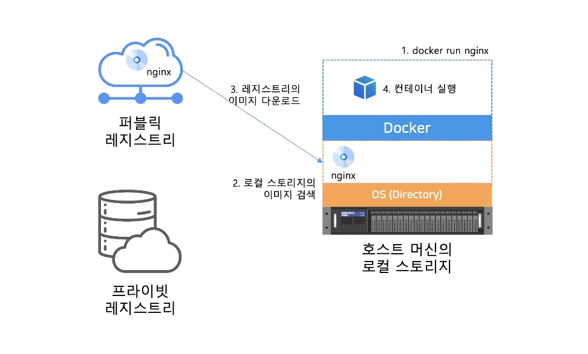

# 섹션 4. 이미지 레지스트리

# 레지스트리와 이미지명

## ✅ 이미지 레지스트리

### **📌 무엇인가용?**

> 컨테이너 이미지를 저장하고 관리하는 **저장소**
> 
- 컨테이너 실행에 필요한 환경과 애플리케이션이 포함된 이미지 파일을 저장
- 가장 많이 사용되는 Public Image Registry 는 Docker Hub

### **📌 역할**

- 기본적으로 이미지 다운로드 및 업로드 기능 제공
- 태그(tag)를 통한 이미지 버전 관리 
→ 사용자는 특정 버전 이미지 선택해서 다운 가능
- 원하는 사용자만 이미지를 다운받을 수 있도록 인증 처리와 관련된 권한 관리 기능 제공
- 이미지 업로드 시 자동 배포 가능하도록 연계 및 알림 기능 제공

## ✅ 이미지가 저장되는 공간



### **📌** 호스트 머신의 로컬 스토리지

**☑️ 정의**

- 도커를 실행하는 호스트 OS의 특정 폴더
    - 이미지가 저장되는 로컬 저장소
    - 실습 환경에서는 내 PC 내 특정 폴더를 의미!

**☑️ 동작 방식**

1. 사용자가 `docker run <이미지명>` 입력
2. docker 는 먼저 로컬 스토리지에 해당하는 이미지가 있는지 검색한다.
3. 있으면 → 바로 실행
없다면 → 외부의 퍼블릭/프라이빗 레지스트리에서 이미지를 로컬 스토리지에 다운받음
4. 다운로드안 이미지 기반으로 컨테이너 실행

### **📌** 온라인 레지스트리

| **퍼블릭 레지스트리** | 인터넷만 가능하면 전 세계 누구나 다운 가능 | Docker Hub |
| --- | --- | --- |
| **프라이빗 레지스트리** | 조직 내부망에서만 사용 가능 (인증 필수) | AWS ECR, Azure ACR |

## ✅ **이미지의 네이밍 규칙**


이미지 이름에는 **어디서(레지스트리), 누구의(프로젝트), 어떤 버전(태그)**의 이미지를 다운받는지에 대한 정보가 모두 포함되어야하는데.. 

우리가 실습에서 nginx 라는 이미지 이름만으로 이미지를 다운할 수 있었던 이유는? → 디폴트로 지정되는 기본값 규칙 덕분에!

| **항목** | **설명** | **기본값** |
| --- | --- | --- |
| 레지스트리 주소 | 이미지를 받을 저장소 주소 | docker.io |
| 프로젝트명 | 이미지를 보관하는 폴더 개념
(docker hub 에서는 가입한 사용자의 계정명이 프로젝트 명이 된다) | library |
| 이미지명 | 실행할 컨테이너 이름(nginx, redis..) | 필수 |
| 이미지태그 | 이미지의 버전 | latest |

---

# 이미지 pull, push

도커 허브에 직접 가입해보고 이미지 다운도르 및 업로드 해보기!

### **📌 둘러보기**

docker hub 에서 nginx 검색해보면 ..


- nginx
    - 도커 허브에서 직접 관리하는 공식 이미지
    - 우리가 실습에서 사용했던..
- 옆에 파란스티커 붙어있는(verified publisher) 는..
    - 도커에서 직접 관리하는 이미지는 아니지만, 어느 정도 규모가 있는 회사에서 자체적으로 인증한 이미지.
    - 도커가 검증한 신뢰할 수 있는 기업 또는 조직이 발행한 이미지

이미지의 버전(tag) 정보도 알 수 있음.


- latest : 기본값~
- stable : 안정적인 릴리즈 버전
- alpine : 이미지 만들기 위해 base 로 사용했던 os의 버전
- slim : 실행에 필수인 파일만 남겨놓고 나머지 모두 제거한 이미지

### **📌 명령어 실습**


### ☑️ **이미지명 추가**

> 다른 사람이 만든 이미지를  내 레지스트리로 Push 하기 위해!
> 
- Docker Hub에서 **프로젝트명은 계정명/이미지명** 형식으로 구성
- 실습용으로 받은 이미지에는 다른 사람의 계정명(예: 실습용 계정)이 포함되어 있음
- 해당 이미지를 그대로 docker push 하면 실습용 게정 레지스트리에 푸시하려고 하는데 → 권한 없으므로 실패한다

⇒ 따라서, 이미지를 . 내계정에 맞게 변경하는 것!!

```bash
1. 이미지 다운로드
docker pull devwikirepo/simple-web:1.0

2. 이미지 태그 추가
docker tag devwikirepo/simple-web:1.0 {레지스트리계정명}/my-simple-web:0.1

3. 추가된 이미지 확인
docker image ls {레지스트리계정명}/my-simple-web:0.1
```


1. 다른 계정(devwikirepo)이 만든 이미지를 내 토컬에 다운
2. 이미지의 내용은 그대로, 이름(경로)만 바꾼다.
→ 파일 복사X 이름(tag)만 붙임O
3. 이름만 바뀌었기 때문에 simple-web 과 my-simple-web 의 이미지 아이디 같은 것 확인 가능

### ☑️ 이미지 업로드

새롭게 추가한 이미지 명 사용해서 이미지 업로드해보자

```bash
1. 레지스트리 로그인
docker login

2. 이미지 푸시
docker push {레지스트리계정명}/my-simple-web:0.1
```

도커 허브에서 이미지 다운 받을 때는 인증이 필요없지만, 이미지를 업로드(push)할 때는 업로드할 계정의 인증 정보가 필요하다! 


### ☑️ 내 레지스트리에 push 한 이미지 실행

```bash
1. 로컬 스토리지와 다운로드받은 이미지 삭제
docker image rm {레지스트리계정명}/my-simple-web:0.1
docker image rm devwikirepo/simple-web:1.0

2. 레지스트리에서 이미지를 다운받아 컨테이너 실행
docker run -d -p 80:80 --name my-simple-web {레지스트리계정명}/my-simple-web:0.1

3. 실습 끝났으니 컨테이너 종료 및 삭제
docker rm -f my-simple-web
```

1. 로컬에 있는 이미지 먼저 삭제해야, 다시 레지스트리에서 pull 받는지 확인 가능함
2. 내 계정의 이미지가 실제로 레지스트리에서 pull 되어서 실행됨

### **📌 이점**

⭐ 이미지 = 실행 가능한 애플리케이션 + 환경

> 이미지의 이름만 공유하면,
docker 가 설치된 어디서든 동일한 서버 환경을 구성할 수 있다!
> 

도커 사용 전에는..

 이미지가 아닌 소스 코드나 애플리케이션 파일로 공유했는데, 실제로 애플리케이션 실행 시 os나 라이브러리가 pc별로 차이가 있어서, 운영 환경에서는 제대로 동작하지 않는 문제가 발생하기도 한다.
