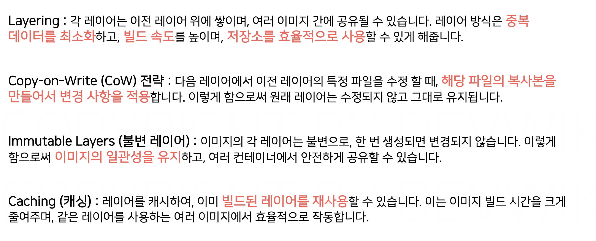

# 섹션 5. 이미지 빌드

# 이미지와 레이어(Layer)

## ✅ 이미지 레이어

### **📌 도커 이미지는 여러개의 Layer 로 구성되어 있다**

> 공간을 효율적으로 사용 가능, 재사용 유리
> 
- 각각의 레이어는 이미지의 일부분을 나타냄
- 이전 레이어에서 변경된 내용들만 저장
- 이미지에서 한 번 저장된 레이어는 변경 불가! **읽기 전용(immutable)**

## ✅ 이미지 레이어와 컨테이너 레이어

| **이미지 레이어** | 컨테이너를 실행하기 위한 세이브 포인트 역할 (읽기 전용) |
| --- | --- |
| **컨테이너 레이어** | - docker run 명령으로 컨테이너 실행 시, 이미지의 가장 마지막 레이어 위에 새롭게 추가된다. (읽기, 쓰기 전용)
- 애플리케이션에서 로그 쌓이거나, 컨테이너가 실행 중에 생기는 모든 변경 사항들 저장  |
- 이미지 레이어는 여러 컨테이너에서 **공유 가능**
- 컨테이너 레이어는 **개별 컨테이너 전용**
    - 전체 파일을 복사하지 않고 변경된 부분만 관리하기 때문에 **속도 빠름, 디스크 공간 절약**

## ✅ 이미지 레이어 실습

```bash
**docker image history <이미지명>**
```

해당하는 이미지의 레이어가 어떻게 구성되어 있는 지 확인해볼 수 있다.

## ✅ 정리



# 이미지 커밋(Commit)

## ✅ 이미지를 만드는 방법

1️⃣ **Commit 방식 :** 실행 중인 컨테이너 상태를 그대로 이미지로 저장

2️⃣ **Build 방식 :** Dockerfile 을 기반으로 명세에 따라 이미지를 생성

- 대부분 Build 방식을 사용하지만, 이는 Commit 을 기반으로 동작함

---

**📌 도커를 디버깅용으로 실행시키는 방법**

```bash
docker run -it --name 컨테이너명 이미지명 bin/bash
```

- `-it` 옵션 : 커맨드 창 통해서 실행할 컨테이너와 직접 상호작용 할 수 있다.
    - 보통 이미지 내부의 파일 시스템을 확인해보거나, 디버깅하는 용도로 사용
- 컨테이너 안에 직접 접속해서 명령어를 실행할 수 있다.

**📌 도커 커밋 명령**

```bash
docker commit -m 커밋명 실행중인컨테이너명 생성할이미지명
```

# 이미지 빌드(Build)

## ✅ IaC (Infrastruture as Code)

> 사람이 수동으로 설정하는 게 아니라, 스크립트와 코드로 인프라 상태를 정의하고 자동화 → **인프라 상태를 코드로 관리**
> 

### 📌 수동 관리 vs. IaC

| **수동 관리** | **IaC** |
| --- | --- |
| 명령어 직접 입력 | 코드로 정의 |
| 실수 발생 가능성  | 자동화로 일관성 유지 가능 |
| 변경 이력 추적 어려움 | 버전 관리 가능 |
| 작업자에 따라 결과가 달라질 수 있음 | 코드 기반으로 항상 같은 결과 보장 |

커밋 방식은 이미지를 만들 때마다 컨테이너 실행, 사용자가 명령어 직접 입력, 커밋 하나당 이미지의 레이어가 하나가 추가되기 때문에 여러 개의 레이어를 추가하고 싶을 때는 여러 개의 커밋 수행해야 하는 문제점이 있다.

### 📌 도커에서  IaC : 이미지 Build 방식

- 도커에서는 Dockerfile을 이용한 **이미지 Build 방식**이 IaC 방법에 해당
- 사람이 일일이 컨테이너 들어가서 설정하는 대신, → **어떤 작업을 할지 코드로 작성**한 파일이 Dockerfile!

```bash
docker build -t 이미지명 Dockerfile 경로
```

### 📌 Dockerfile 문법


- **FROM**
    - 도커 파일에서 필수로 표시해야 함
    - 이미지를 빌드할 때 필요한 파일 시스템이 있는 이미지를 베이스 이미지로 지정하는 것이 좋음

```bash
// 현재 디렉토리(.)에 있는 Dockerfile을 이용해 도커 이미지를 빌드함
docker build -t choyeongju/buildnginx .

// 위에서 만든 이미지를 기반으로 컨테이너를 실행
docker run -d -p 80:80 --name build-nginx choyeongju/buildnginx
```


# 빌드 컨텍스트(Build Context)

## ✅ 빌드 컨텍스트

> **Dockerfile로 이미지 빌드할 때,
도커 데몬(docker engine) 에 전달되는 파일/폴더들의 집합

⇒ docker build 명령 실행 시, 도커 데몬에게 넘겨주는 작업 공간**
> 


이전 빌드 실습에서 인덱스와 도커 파일을 작성했었던 buildnginx 폴더가 build context 였다!

### 📌 .dockerignore

> 빌드 컨텍스트에 **제외할 파일 목록** 정의
> 


- largejunk 라는 빌드에 불필요한 파일을 .dockerignore 파일에 명시하면,
빌드 컨텍스트에서 제외시켜서 도커 데몬에는 이 파일 제외하고 전달 가능함!
- .gitignore 과 같은 방식으로 동작함

즉, 빌드 컨텍스트에는 실제로 빌드에 필요한 것만 넣어 놓는 것이 중요해요 ~~

# 도커파일(Dockerfile) 지시어

## ✅ 이미지 빌드 vs. 애플리케이션 빌드


| **애플리케이션 빌드** | 소스코드를 실행 가능한 프로그램(App)으로 만드는 과정 | → 앱을 만드는 것 |
| --- | --- | --- |
| **이미지 빌드** | Dockerfile 을 기반으로 실행환경 + 프로그램 + 설정을 담은 이미지를 생성하는 과정 | → 그 앱을 실행할 수 있는 환경을 만드는 것 |

## ✅ 기본 Dockerfile 지시어


- `RUN` : 컨테이너 안에서 명령어를 실행하고 결과를 새로운 레이어로 저장한다.
    - **이미지 빌드 시점**에 실행됨 (컨테이너 실행 전)
- `CMD` : 컨테이너의 실행 때만 사용되기 때문에 별도의 이미지 레이어를 추가하지 않는다.
    - 메타데이터에만 영향을 주는 부분은 레이어 추가 X
    - 단지 이미지에 실행 방법을 “기록”하는 정도!

⇒ 이 지시어들을 잘 활용하면, 이미지 레이어의 개수를 관리할 수 있다.

**❓ 근데 어떻게???? 강의에 안나옴** 

- Example 1) RUN 여러 개를 한 줄로 합치면?

```bash
# 2줄짜리를
RUN apt-get update
RUN apt-get install -y curl

# 1개로 합치면 -> 레이어 1개만 추가됨!
RUN apt-get update && apt-get install -y curl
```

- Example 2) COPY 여러 개를 한 줄로 합치면?

```bash
COPY index.html /app/index.html
COPY style.css /app/style.css

COPY . /app
```

### 📌 이미지 빌드


- `-f` 옵션
    - 일반적으로는 Dockerfile 의 이름을 Dockerfile 이라고 지정하는데, 종종 이 파일의 이름을 다르게 저장하는 경우가 있다.
    - When? case 별로 다른 Dockerfile 빌드가 필요한 경우
    - 그래서 이런 경우는 빌드에 사용할 Dockerfile 의 이름을 지정해 주어야 한다.

### 📌 도커 사용의 장점

내 로컬에 Node.js 가 없더라도 컨테이너 이미지로 실행할 수 있다.

---


- `WORKDIR` : 컨테이너 내부에서 명령어가 실행될 **작업 디렉토리** 설정 (cd 개념)
    - 이후의 모든 COPY, RUN, CMD 등은 이 디렉토리 기준으로 실행되므로, 가능한 FORM 다음에 바로 작성하는 것이 좋다.
    - 디렉토리가 존재하지 않아도 자동 생성된다.
- `USER`
    - 기본적으로 Docker는 **root 사용자**로 실행 → 실행된 프로세스가 굉장히 많은 권한을 가질 수 있음.
    - 이 점은 보안상 취약할 수 있으므로, USER 지시어로 조작할 수 있다.
    - 보안상 root(관리자) 대신 일반 유저 권한을 쓰는 게 좋음
    - But, 일반 유저로 전환하기 전, 권한이 필요한 작업은 먼저 처리해야 함!
- `EXPOSE` : 컨테이너가 사용할 포트를 “문서” 처럼 명시
    - 이를 사용하지 않아도 기본적으로 컨테이너는 모든 포트를 사용할 수 있다.
    - 실제로 포트 여는 역할은 X (실제로 포트를 여는 건 docker run -p에서 설정함)
    - 그럼에도 이를 사용하는 이유는, 이 Dockerfile 을 읽는 다른 사람에게 애플리케이션이 사용하는 포트를 문서처럼 기재하기 위해서이다.

---


### 📌 ARG 와 ENV 의 차이

> 컨테이너를 실행할 때 환경 변수가 유지되는지에 대한 여부
> 

|  | **ARG** | **ENV** |
| --- | --- | --- |
| **사용 시점** | docker build 명령으로 이미지를 빌드할 때만 사용  | build 중 뿐만 아니라, 이 이미지를 컨테이너로 실행할 때도 유지 |
| **유지 여부** | 이미지 안에 저장 X → 컨테이너에서 사용 불가 | 이미지에 영구 저장 |
| **방법** |  `--build -arg` 옵션으로 덮어쓰기 가능 | `-e` 옵션으로 덮어쓰기 가능 |
|  | → 빌드에만 사용할 환경 변수를 지정할 때 사용 | → 애플리케이션 실행 시 참고할 용도로 사용 |


- ARG(3001)로 적용된 값은 컨테이너로 실행할 떄는 적용이 되지 않기 때문에, 애플리케이션의 기본 값인 초록색으로 적용된 것을 확인 가능하다.
- ENV(3002)로 적용된 값은 지정한 COLOER=red 값이 정상적으로 적용되었다.

---


- `CMD`
    - 여기에 들어가는 명령어는 띄어쓰기를 기준으로 여러 개를 넣을 수 있다.
    - CMD 로 지정하는 명령어 중에서 일반적으로는 고정되는 값들이 많이 있다.
- `ENRTYPOINT`
    - 예를 들어.. Node.js 환경에서는 npm start, npm install 처럼 npm 이라는 부분이 계속 중복되게 되는데,
    - 이는 Dockerfile 의 ENRTYPOINT 로 지정해서 관리할 수 있다.
        
        
        
        ⇒ 실제 실행 명령 : npm start
        
    - 이를 사용해서 사용자가 의도하지 않은 명령어로 접근하는 것을 1차적으로 막을 수있다. But, 이게 보안적으로 완벽하게 안전한 부분은 아니다. (컨테이너를 root로 실행하거나.. shell 로 접근이 가능하면..)

# 멀티 스테이지 빌드(Multi-Stage Build)

## ✅ 싱글 스테이지 빌드

> Build 와 실행 환경을 한 이미지 안에 모두 포함
> 


- 위의 과정에서  Maven, 소스코드, 라이브러리 등 애플리케이션 실행에 불필요한 파일도 함께 들어감
- 실행용 이미지의 사이즈가 커지면 애플리케이션 실행 시간에 영향을 줄 수 있다.

## ✅ 멀티 스테이지 빌드

> Build 용 이미지와 실행용 이미지를 분리
> 
- 빌드 결과물(.jar, .exe, etc)만 실행 이미지에 복사 → 용량 작고 효율적


FORM 이 2개 있는 것을 확인 가능

- `openjdk:11-jre-slim` : 자바 애플리케이션 실행에 필요한 java runtime 만 가지고 있는 이미지
- `AS build : maven` 이미지를 사용한 stage의 이름을 build 로 지정
- `--from` : 다른 stage에서 파일을 가져 올 때 사용
    - Build Context 에 있는 파일을 가져오는 것이 아니라, build 라고 이름지어진 Maven stage애서 파일을 가져오는 것! (아래 표시)
    
    
    


위의 용량이 훨씬 줄어든 것을 확인할 수 있다.

### 📌 정리


