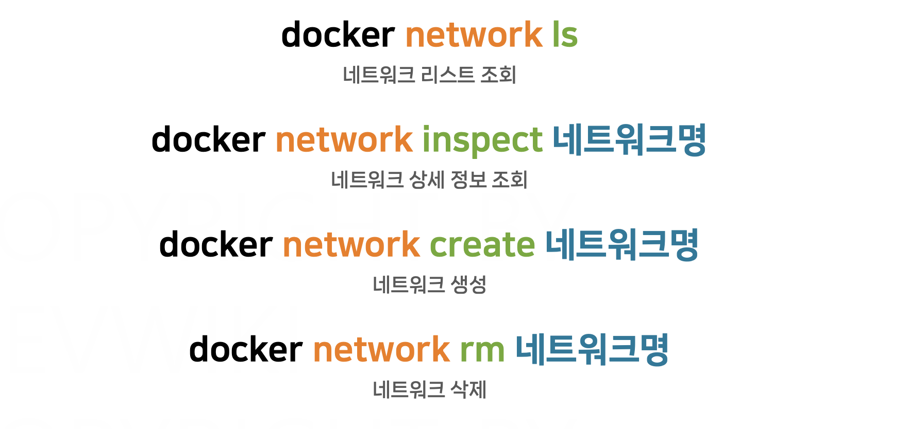

# 섹션 7.  도커 네트워크

# 네트워크 기본

## ✅ 개념

- 네트워크 : 기기 간의 정보를 주고받기 위한 통신망
- IP
    - 공인 IP : 외부 인터넷망에서 사용
    - 사설 IP : 내부 네트워크에서만 사용하는 사설 IP
    - 공인 IP를 공유기에 연결해서 → 여러 개의 사설 IP 로 분리 → TV, 컴퓨터, 스마트폰 여러 기기로 나누어 사용 가능
- 네트워크의 통신 방향
    - 아웃바운드 : 서버에서 외부로 신호를 보내는 방향
    - 인바운드 : 외부에서 서버로 신호를 받는 방향
- NAT ****(Network Address Translation)
    - 내부 네트워크의 사설 IP를 외부 인터넷에서 인식할 수 있는 공인 IP로 변환해주는 기술
- 포트 포워딩 (Port forwarding)
    - 특정 포트로 들어온 인바운드 트래픽을 내부 네트워크의 특정 기기(사설 IP)로 전달하는 기술
- DNS (Domain Name System)
    - 사람이 읽기 쉬운 도메인 이름(google.com)을 실제 통신에 사용되는 IP 주소(142.250.190.14)로 변환하는 시스템

# 도커 가상네트워크 (1)

- 도커는 컨테이너 간 통신을 위해 Bridge 네트워크를 정의하고, 호스트 OS에 가상 인터페이스들을 생성한다.
- 도커는 호스트 OS의 iptables 규칙을 관리하면서 가상 인터페이스들 간의 통신 규칙을 설정한다.

### 📌 기본 통신 구조

- 사용자는 별도의 설정 없이도, 같은 브릿지 네트워크에 속한 컨테이너들끼리는 기본적으로 서로 통신 가능한 상태가 된다.
- 도커는 이 가상 네트워크 내부에서 여러 개의 브릿지 네트워크를 관리할 수 있다.
    - 기본적으로 같은 네트워크 안에 있는 컨테이너들끼리는 통신할 수 있지만,
    - 브릿지 네트워크를 여러 개로 분리하면 특정 컨테이너들끼리는 통신을 차단할 수도 있다!

### 📌 도커 브릿지 네트워크 생성 실습

- 새로운 second 브릿지 생성
- 각각의 컨테이너끼리 통신
    - a와 b는 서로 통신 가능.
    - But, 다른 네트워크에 소속되어 있는 c와는 통신 불가

⇒ 같은 브릿지에 속해있는 컨테이너들끼리만 통신이 가능

# 도커 가상네트워크 (2)

## **✅ 포트 포워딩 개념**

- 도커 가상 네트워크 안에서 컨테이너끼리는 기본적으로 서로 통신 가능
- But, 호스트 OS나 외부 서버에서 컨테이너에 접근하려면 포트 포워딩 기술이 필요하다.
But,

### 📌 NAT **(Network Address Translation)**

- 도커는 가상 네트워크에 NAT를 자동으로 설정해준다.
- 덕분에 컨테이너 내부에서는 별다른 설정 없이 외부 서버(인터넷 등)로 접근이 가능하다.
- 다만, 외부 통신을 위해서는 도커가 실행 중인 호스트 서버(PC)가 물리적 네트워크에 연결되어 있어야 한다.

### 📌 포트 포워딩

> 외부의 서버에서 내 컨테이너로 접근할 때
> 
- 도커가 실행 중인 호스트 OS의 IP (ex. 192.168.0.10)로 접근한다.
- 포트 포워딩 사용해서 192.168.0.10의 특정 포트로 접근했을 때, 사용자가 지정한 컨테이너로 전달하도록 → 포트 포워딩을 등록해야 함!
    
    
    
- 호스트 OS의 포트는 자유롭게 설정할 수 있음.
    - But, 이미 등록된 포트는 중복 사용 불가!

### 📌 가상 네트워크와 DNS

- 도커는 컨테이너들이 기본적으로 사용할 수 있는 DNS 서버를 제공한다.
    - 이 DNS 서버에는 IP 주소와 도메인 명이 저장되어 있다.
    - **컨테이너 이름**을 도메인처럼 사용해서 통신 가능
    - 즉, DNS 서버는 외부의 DNS 서버와 연동이 되어 있으므로 컨테이너 내부에서도 외부 도메인(구글 등)으로 접근 가능
- 다만,
    - *기본으로 생성되는 브릿지 네트워크에서는* 이  DNS 기능이 제공되지 않는다.
    - *사용자가 직접 생성한 브릿지 네트워크에서만* 컨테이너의 이름을 통해서 통신 가능.

# Leafty 네트워크

## ✅ 기본 개념

- 외부 접근이 필요한 컨테이너는 포트포워딩을 통해서 호스트 PC의 IP와 연결할 수 있다.
- 반면, 외부와 직접 통신할 필요가 없는 컨테이너(ex. 데이터베이스)는 포트포워딩 설정 안하고, 컨테이너 간 통신 통신만 허용할 수 있다.

### 📌 컨테이너 간 통신

- 도커는 컨테이너마다 도메인 이름을 자동으로 설정해준다.
- 컨테이너들끼리는 컨테이너 이름을 도메인명처럼 사용해서 통신할 수 있다.
    - ex) db-container 라는 이름을 가진 컨테이너에 db-container:3306 식으로 접근 가능
- 이 방식을 통해 IP 주소를 몰라도 컨테이너끼리 안정적으로 통신할 수 있다.
